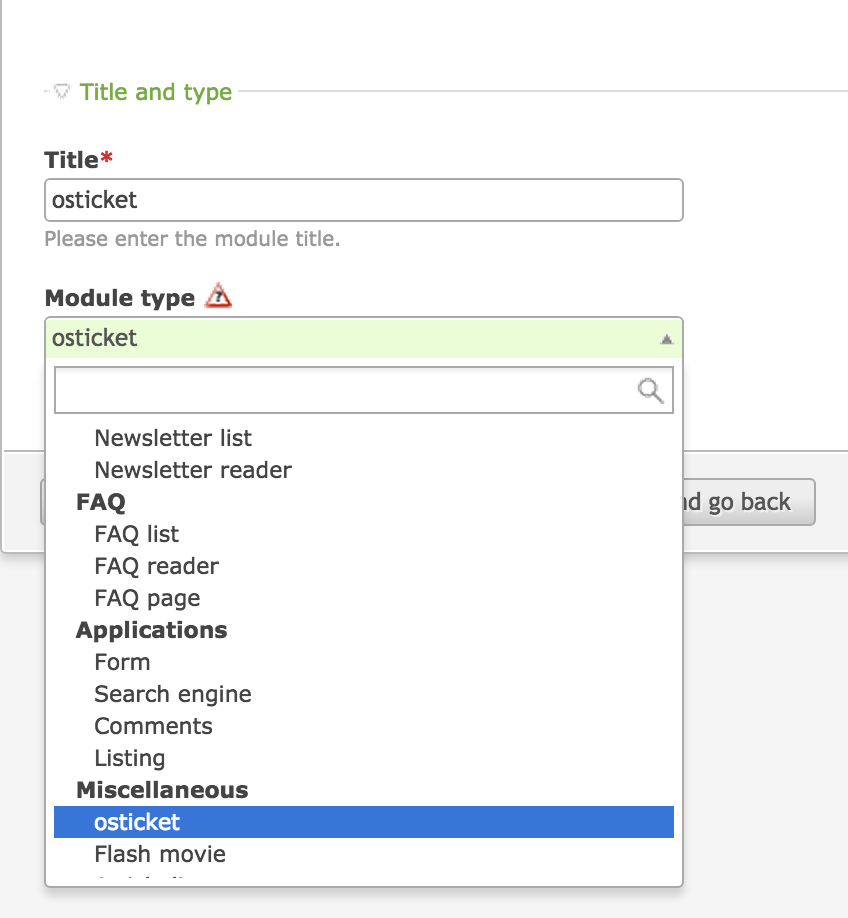

# osTicket Contao CMS Extension

## Installation

### FTP

Put `osticket` folder in `\system\module\`.

## Configuration

### Settings
Enter your osTickets API settings in your Contao backoffice (osTicket module in Content menu)

If you want to use a captcha, enter your public and secret keys (you can find it on google recaptcha website https://www.google.com/recaptcha).

### Display New Ticket form

First, add osTicket module in your theme presentation.

Then, in your articles, add a module element which is osTicket module.

